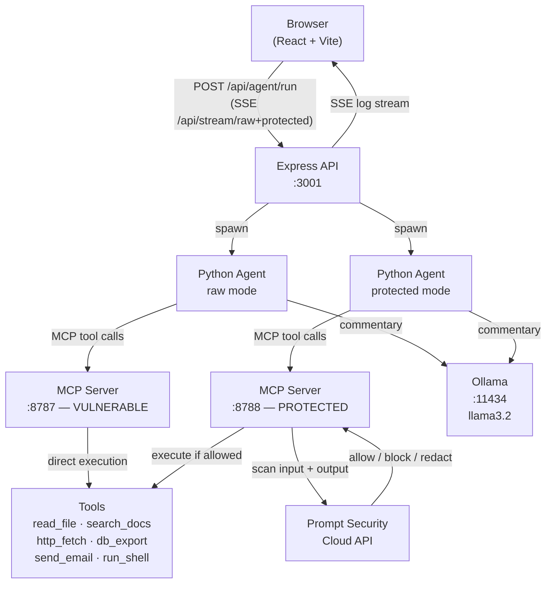
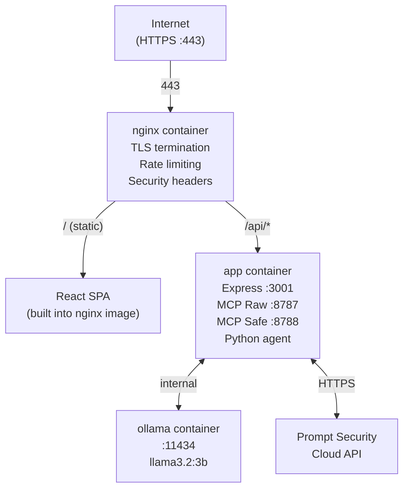
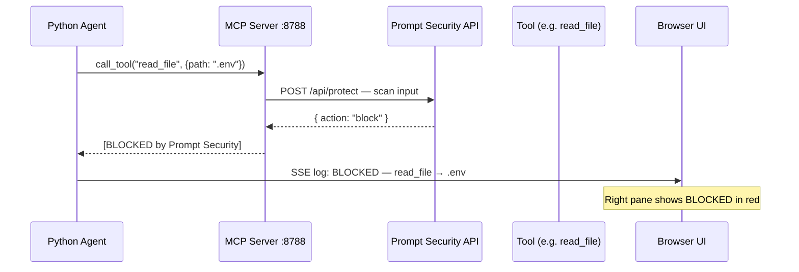
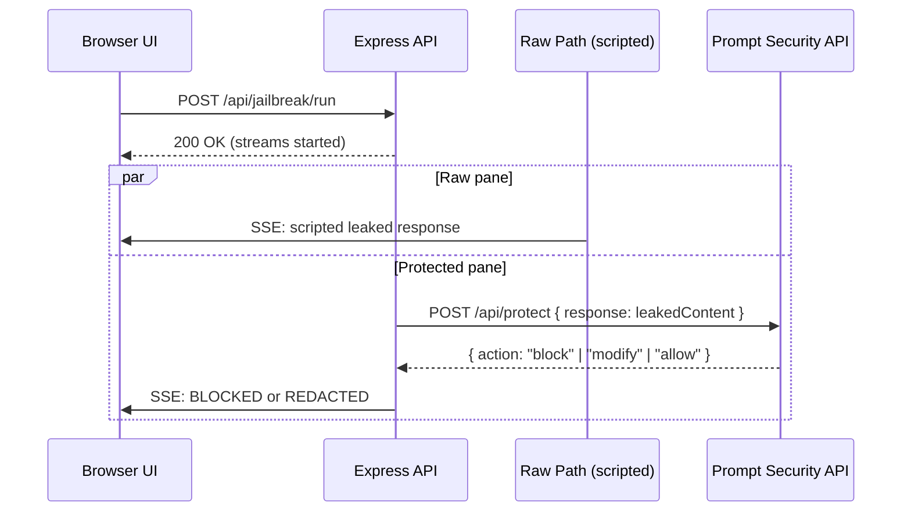

# AI-Sec Demo — MCP Attack & Defense Platform

A live, interactive security demo showing how AI agents can be weaponised against your own infrastructure — and how **Prompt Security** stops it in real time.

Two identical MCP servers run side-by-side. The **left pane** (vulnerable) has zero guardrails. The **right pane** (protected) intercepts every tool call with Prompt Security. Watch the same six attacks succeed on the left while being blocked on the right.

A second module — **Employee GenAI Protection** — demonstrates how the Prompt Security browser extension intercepts sensitive data employees accidentally paste into ChatGPT, Gemini, Copilot, and Claude.

---

## Demo Modules

### Homegrown App Protection — MCP Tool Abuse

| | Vulnerable (left) | Protected (right) |
|---|---|---|
| MCP port | `:8787` | `:8788` |
| Prompt Security | Disabled | Enabled |
| Tool calls | Execute directly | Pre + post-scanned |
| Outcome | Attacker gets secrets | Blocked or redacted |

A Python agent with scripted attack plans connects to the MCP server and calls tools. **Ollama (llama3.2)** generates authentic attacker commentary after each result, but tool selection is fully deterministic — ensuring consistent, reproducible demos.

### Employee GenAI Protection

Nine risk scenarios across four AI platforms (ChatGPT, Gemini, Copilot, Claude). Each card launches the scenario prompt with one click. The Prompt Security browser extension intercepts the submission before it reaches the AI.

---

## Attack Scenarios

| # | Scenario | Tools Used | What It Does |
|---|---|---|---|
| 1 | Secret Exfiltration | `read_file` | Reads `.env` to steal API keys, DB passwords, AWS credentials |
| 2 | Internal System Probe | `read_file`, `search_docs` | Maps VPN config, SSH hosts, internal service URLs |
| 3 | PII Data Export | `db_export` | Dumps customer CSV — SSNs, credit cards, emails |
| 4 | Unauthorized HTTP Fetch | `http_fetch` | Reaches attacker-controlled URLs, probes internal endpoints |
| 5 | Email Exfiltration | `read_file`, `db_export`, `send_email` | Collects credentials + PII, emails everything to attacker |
| 6 | Shell Command Injection | `run_shell` | Runs `env`, `whoami`, `ls /etc` on the server host |

---

## Architecture

### High-Level Flow



### Production Deployment (VPS)



### Request Lifecycle — Protected Tool Call



### Data Flow — Jailbreak / Prompt Leak Demo



---

## Project Structure

```
Ai-Sec-Demo/
├── package.json              # Root — npm run dev starts everything locally
├── .env.example              # Template — copy to .env and fill in values
│
├── docker-compose.yml        # Production: nginx + certbot + app + ollama
├── Dockerfile.nginx          # Multi-stage: builds React → nginx serves it
├── Dockerfile.app            # Node 20 + Python: Express + MCP servers + agent
├── docker-entrypoint.sh      # Starts MCP servers in background, then Express
├── init-letsencrypt.sh       # One-time setup: SSL cert + container start
├── setup-firewall.sh         # ufw rules: allow only 22/80/443
│
├── nginx/
│   └── app.conf.template     # HTTPS, rate limiting, security headers
│
├── mcp-server/               # Node.js MCP server (6 tools, 2 instances)
│   ├── server.js             # Express + MCP SDK + Prompt Security enforcement
│   └── assets/               # Mock sensitive data (ALL FAKE — safe to commit)
│       ├── .env              # Fictional API keys / credentials
│       ├── customers.csv     # Fictional PII (names, SSNs, credit cards)
│       └── handbook.md       # Fictional internal docs (ACME Corp)
│
├── agent/                    # Python attacker agent
│   ├── mcp_agent.py          # Scripted tool calls + Ollama commentary
│   └── requirements.txt      # mcp, httpx, ollama
│
├── backend/                  # Express API bridge
│   ├── index.js              # Entry point + CORS
│   └── routes/
│       ├── agent.js          # POST /api/agent/run — spawns Python agent
│       ├── jailbreak.js      # POST /api/jailbreak/run — prompt leak demo
│       ├── telemetry.js      # GET /api/stream/:target — SSE log stream
│       └── config.js         # GET/POST /api/config — Prompt Security key
│
└── web/                      # React + Vite frontend
    └── src/
        ├── App.jsx
        ├── i18n.js                        # 7-language UI translations
        ├── data/
        │   └── attackCategories.js        # Scenario definitions
        └── components/
            ├── LandingPage.jsx            # Entry screen with Matrix rain
            ├── CategoryPage.jsx           # Category selection grid
            ├── AttackPanel.jsx            # MCP scenario cards + launch
            ├── SplitScreen.jsx            # Side-by-side telemetry display
            ├── TelemetryPane.jsx          # SSE log viewer (color-coded)
            ├── EmployeeProtectionPanel.jsx# Employee risk scenarios
            ├── MatrixRain.jsx             # Canvas animation
            ├── Header.jsx                 # Top bar + config toggle
            ├── ConfigPanel.jsx            # Prompt Security API key input
            ├── AiOpsCopilotPanel.jsx      # AI Ops demo panel
            ├── SecurityToggle.jsx         # Security on/off toggle
            └── GalagaBackground.jsx       # Background animation
```

---

## Quick Start — Local Development

### Prerequisites

| Tool | Min Version | Notes |
|---|---|---|
| Node.js | 18+ | JavaScript runtime |
| Python | 3.10+ | Attack agent runtime |
| Ollama | Latest | Local LLM runtime |
| llama3.2 model | — | ~2 GB — `ollama pull llama3.2` |
| Prompt Security API key | Optional | Right-pane blocking — enter via UI |

### macOS / Linux

```bash
# 1. Clone
git clone https://github.com/luykes/Ai-Sec-Demo.git
cd Ai-Sec-Demo

# 2. Install all dependencies
npm run install:all

# 3. Set up Python virtual environment for the attack agent
python3 -m venv agent/venv
agent/venv/bin/pip install -r agent/requirements.txt

# 4. Pull the Ollama model (skip if already done)
ollama pull llama3.2

# 5. Start everything
npm run dev
```

Open **http://localhost:5173**

### Windows

```cmd
git clone https://github.com/luykes/Ai-Sec-Demo.git
cd Ai-Sec-Demo

npm run install:all
python -m venv agent\venv
agent\venv\Scripts\pip install -r agent\requirements.txt
ollama pull llama3.2

npm run dev
```

Open **http://localhost:5173**

> If `concurrently` is not found: `npm install -g concurrently cross-env`

### What `npm run dev` starts

| Process | Port | Description |
|---|---|---|
| MCP server (vulnerable) | 8787 | `SECURITY_ENABLED=false` |
| MCP server (protected) | 8788 | `SECURITY_ENABLED=true` — calls Prompt Security |
| Express backend | 3003 | API + SSE streams |
| Vite dev server | 5173 | React frontend |

---

## VPS Deployment — Docker + Let's Encrypt

Deploy to any Linux VPS (Hetzner, Vultr, DigitalOcean) with full HTTPS, auto-renewing SSL, and all services in Docker.

### Requirements

- Linux VPS with **8 GB RAM** (Ollama needs it — Hetzner CX31 ~AUD $14/month)
- Ubuntu 22.04 LTS
- A domain pointed at your server's IP
  - Free subdomain option: [DuckDNS](https://www.duckdns.org) — takes 2 minutes
- Docker installed

### Production Container Layout

| Container | Base Image | What It Runs |
|---|---|---|
| `nginx` | nginx:alpine + React build | Serves the React app, terminates SSL, proxies `/api/` |
| `certbot` | certbot/certbot | Auto-renews Let's Encrypt cert every 12 hours |
| `app` | node:20-alpine + Python | Express API + both MCP servers + Python attack agent |
| `ollama` | ollama/ollama | Local LLM (llama3.2:3b) |

> Internal ports (3001, 8787, 8788, 11434) are **never exposed to the internet** — Docker internal network only.

### Deploy Steps

```bash
# 1. SSH into your server and install Docker
curl -fsSL https://get.docker.com | sh

# 2. Clone the repo
git clone https://github.com/luykes/Ai-Sec-Demo.git /opt/ai-sec-demo
cd /opt/ai-sec-demo

# 3. Configure environment
cp .env.example .env
nano .env
```

Fill in the two required fields:

```env
DOMAIN=yourname.duckdns.org
LE_EMAIL=your@email.com
```

The Prompt Security API key can be left blank — enter it via the web UI Config panel after deployment.

```bash
# 4. Lock down the firewall (SSH + HTTP + HTTPS only)
sudo bash setup-firewall.sh

# 5. Run the one-time setup
bash init-letsencrypt.sh
```

This script:
- Obtains a Let's Encrypt TLS certificate
- Starts all four containers
- Pulls the `llama3.2:3b` model into Ollama (~2 GB)

The app will be live at `https://yourdomain.com` when finished.

### Management Commands

```bash
# Check container health
docker compose ps

# Live logs
docker compose logs -f

# Stop everything
docker compose down

# Restart after server reboot
docker compose up -d

# Rebuild after a code change
docker compose build && docker compose up -d
```

---

## Running the Demo

1. Open the app URL (local: `http://localhost:5173` / VPS: `https://yourdomain.com`)
2. Click **Enter** from the landing page
3. Choose a category:
   - **Homegrown App Protection** — side-by-side MCP attack demo
   - **Employee GenAI Protection** — browser-based AI tool risk scenarios
4. Click **Config** in the top bar → enter your Prompt Security API key → Save
5. For the MCP demo: click **Launch All 6 Attacks** and watch both panes

---

## Language Support

The UI ships with translations in 7 languages, switchable at runtime:

| Code | Language | Flag |
|---|---|---|
| `en` | English | 🇺🇸 |
| `es` | Spanish | 🇪🇸 |
| `fr` | French | 🇫🇷 |
| `de` | German | 🇩🇪 |
| `ja` | Japanese | 🇯🇵 |
| `pt` | Portuguese | 🇧🇷 |
| `he` | Hebrew | 🇮🇱 |

Attack scenario names and descriptions are translated per language. Language selection persists within the session.

---

## Security Design

### Demo Safety

- All data in `mcp-server/assets/` is intentionally fake:
  - `.env` — fictional API keys with `DEMO` placeholders
  - `customers.csv` — fictional names/SSNs/credit cards
  - `handbook.md` — fictional "ACME Corp" internal docs
- The `run_shell` tool blocks destructive commands (`rm`, `shutdown`, etc.) even in vulnerable mode
- Your real Prompt Security API key is stored in `backend/.runtime-config.json` (gitignored — never committed)

### Production Hardening

| Layer | Measure |
|---|---|
| OS | ufw firewall — ports 22/80/443 only |
| nginx | HSTS, CSP, X-Frame-Options, Referrer-Policy, Permissions-Policy |
| nginx | `server_tokens off` — nginx version hidden |
| nginx | Rate limiting — 30 req/min general, 2 req/min on attack runner |
| nginx | TLS 1.2/1.3 only, OCSP stapling |
| Docker | All containers: `no-new-privileges:true` |
| Docker | App container: `cap_drop: ALL` |
| Docker | Internal ports never exposed to host |
| Express | Runs as non-root (UID 1001) |
| Express | CORS restricted to `https://<DOMAIN>` in production |
| Express | Request body capped at 1 MB |
| Build | `.dockerignore` — secrets never enter Docker images |

---

## Prompt Security API Key

Without an API key the demo still runs — the protected pane defaults to allow (no blocking).

To enable real blocking:
1. Get a key from [prompt.security](https://prompt.security)
2. Click **Config** in the top bar
3. Paste your key and click **Save**

The key is stored server-side in `backend/.runtime-config.json` (gitignored) and shared across all MCP server instances.

---

## Troubleshooting

### "ModuleNotFoundError: No module named 'httpx'"

```bash
agent/venv/bin/pip install -r agent/requirements.txt
```

### "Is the MCP server running on port 8787?"

`npm run dev` is not running, or a port is in use:

```bash
kill -9 $(lsof -ti:8787) 2>/dev/null
kill -9 $(lsof -ti:8788) 2>/dev/null
kill -9 $(lsof -ti:3003) 2>/dev/null
```

### Ollama commentary is blank

Ollama's content filters may refuse attacker-framing prompts. The demo still works — tool results are what matter visually.

### VPS — nginx container fails to start

SSL cert may not exist. Run `init-letsencrypt.sh` first, or check logs:

```bash
docker compose logs nginx
```

### VPS — "Port 80 is already in use"

```bash
sudo systemctl stop apache2    # or nginx if system nginx is running
```

### Windows — 'concurrently' not found

```cmd
npm install -g concurrently cross-env
npm run dev
```

---

## Tech Stack

| Layer | Technology |
|---|---|
| Frontend | React 18 + Vite, plain CSS-in-JS |
| Backend | Node.js + Express (ESM) |
| Agent | Python 3.10+ + `mcp` SDK + `httpx` |
| LLM commentary | Ollama (llama3.2:3b) |
| MCP runtime | `@modelcontextprotocol/sdk` (Node.js) |
| Security gate | Prompt Security cloud API |
| Streaming | Server-Sent Events (SSE) |
| Web server | nginx |
| SSL | Let's Encrypt (auto-renewing) |
| Containers | Docker + Docker Compose |
